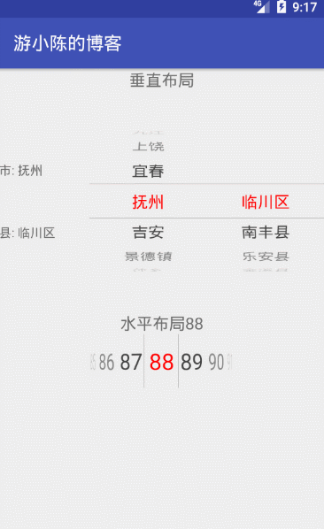
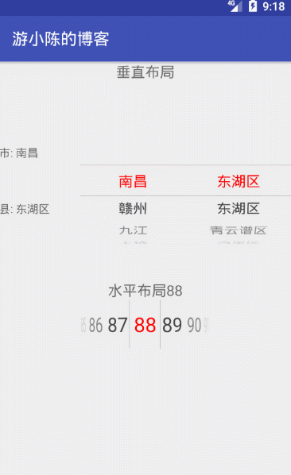
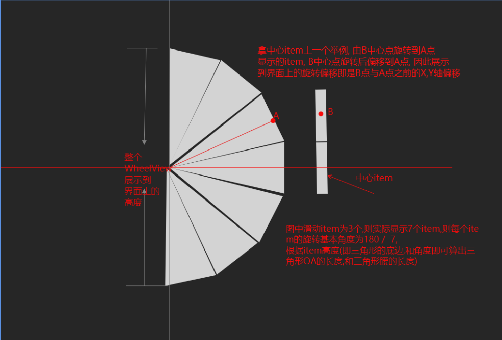

# WheelView-3d
### WheelView extends ViewGroup, Camera, Matrix 实现WheelView 3d效果

##使用
```
allprojects {
    repositories {
        ...
        maven { url 'https://jitpack.io' }
    }  
}

dependencies {
	implementation 'com.github.youxiaochen:WheelView-3d:1.3.0'
}
```

### 如果要实现比较复杂的任何布局方式整个childView旋转效果可以参考博客  http://www.jianshu.com/p/41e4602deca6

### 博客地址 http://www.jianshu.com/p/77656dbb07b2

#### [测试包下载](imgs/demo.apk)



<br/>


<br/>



```
<declare-styleable name="WheelView">
    <!-- 布局方向 -->
    <attr name="wheelOrientation">
        <enum name="vertical" value="1"/>
        <enum name="horizontal" value="0"/>
    </attr>
    <!-- 中间分割线外的item数量,整个滑动数量就为 wheelItemCount * 2 + 1  -->
    <attr name="wheelItemCount" format="integer"/>
    <!-- 滑轮item高度 -->
    <attr name="wheelItemSize" format="dimension"/>
    <!-- 水平布局时不考虑只参数,  当垂直布局时的左右靠齐立体效果 -->
    <attr name="wheelGravity">
        <enum name="center" value="0"/>
        <enum name="left" value="1"/>
        <enum name="right" value="2"/>
    </attr>
    <!-- 滑轮字体大小 -->
    <attr name="wheelTextSize" format="dimension"/>
    <!-- 滑轮字体颜色 -->
    <attr name="wheelTextColor" format="color"/>
    <!-- 滑轮中心字体颜色 -->
    <attr name="wheelTextCenterColor" format="color"/>
    <!--   颜色透明度是否渐变     -->
    <attr name="wheelGradient" format="boolean"/>
    <!-- 分割线大小 -->
    <attr name="wheelDividerSize" format="dimension"/>
    <!-- 分割线颜色 -->
    <attr name="wheelDividerColor" format="color"/>
    <!-- 分割线填充值默认为0, 分割线矩阵大小为itemSize + dividerPadding -->
    <attr name="wheelDividerPadding" format="dimension"/>
</declare-styleable>

```

### 布局生成WheelView使用方式, 不设置时使用将使用默认值

```
<chen.you.wheel.WheelView
    android:id="@+id/wv_city"
    android:layout_width="wrap_content"
    android:layout_height="wrap_content"
    app:wheelOrientation="vertical"
    app:wheelItemCount="3"
    app:wheelItemSize="30dp"
    app:wheelGravity="center"
    app:wheelTextSize="18sp"
    app:wheelTextColor="#333333"
    app:wheelTextCenterColor="#ff00ff"
    app:wheelDividerSize="1dp"
    app:wheelDividerColor="#00ff00"
    app:wheelGradient="true"
    app:wheelDividerPadding="2dp"/>

wheelView.setAdater(adapter)
```

### 代码生成WheelView及更多使用方式, WheelParams, DrawManager, ItemPainter都有默认值可不设置
```
WheelParams params = new WheelParams.Builder()
        .setOrientation(WheelParams.HORIZONTAL)
        .setItemSize(...)
        .setTextColor(...)
WheelView wv = new WheelView(context, params);
        ...
//代码设置各种属性
//亦可用此方式设置各属性  
wv.getWheelParams().newBuilder().setOrientation(...) 
wv.setWheelParams(params);
//设置绘制管理, 默认为WheelDrawManager产生3D旋转, 亦可设置LinearDrawManager不旋转, 也可自定义DrawManager扩展
wv.setDrawManager(new WheelDrawManager());
//设置绘制器, 默认为SimpleItemPainter,  也可自定义绘制器扩展
wv.setItemPainter(...)  
wv.setAdapter(new WheelView.Adapter() {
    @Override
    protected String getItem(int position) {
        return "position " + position;
    }

    @Override
    protected int getItemCount() {
        return 100;
    }
});

adapter.notifyDataSetChanged() ...

```

### E-mail-QQ: 86207610@qq.com  W: 86207610   Welcome to star

#### 博客地址 http://www.jianshu.com/p/77656dbb07b2

#### 如果要实现比较复杂的任何布局方式整个childView旋转效果可以参考博客  http://www.jianshu.com/p/41e4602deca6


